# Post Install Customization and Basic Setup

## Accessing the Terminal

To use the Ubuntu Terminal, press the ⌘ key, then search for `Terminal`. Press `Enter` to launch the terminal app.
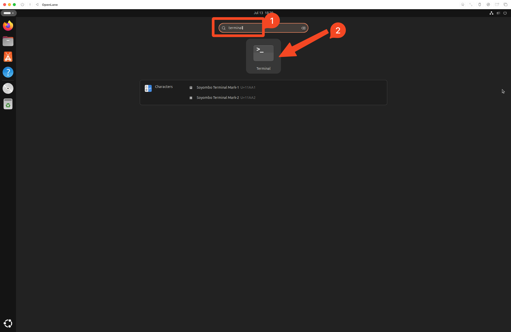

You have now launched the Ubuntu terminal.
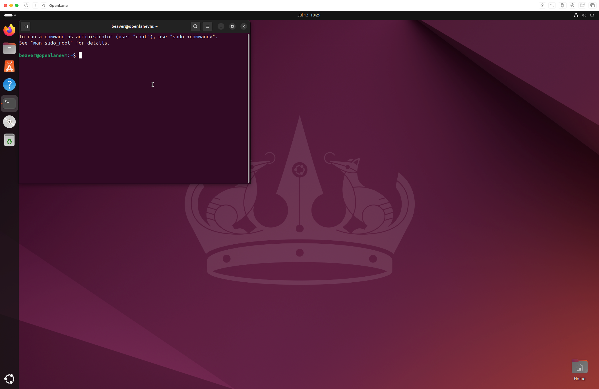

## Mount the shared drive

Open the terminal, then run

```bash
$ sudo apt install spice-webdavd
```

Enter your password when prompted

Enter `Y\n` when prompted `Do you want to continue?`
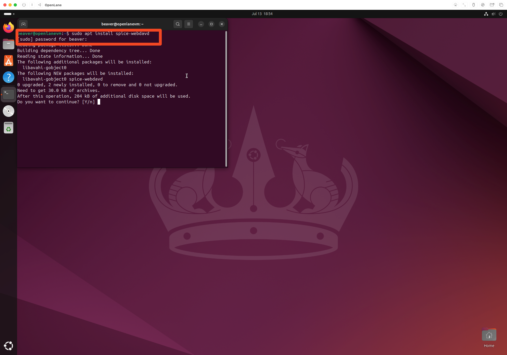

Open files, navigate to `Other Locations`, and double click `Spice client folder`
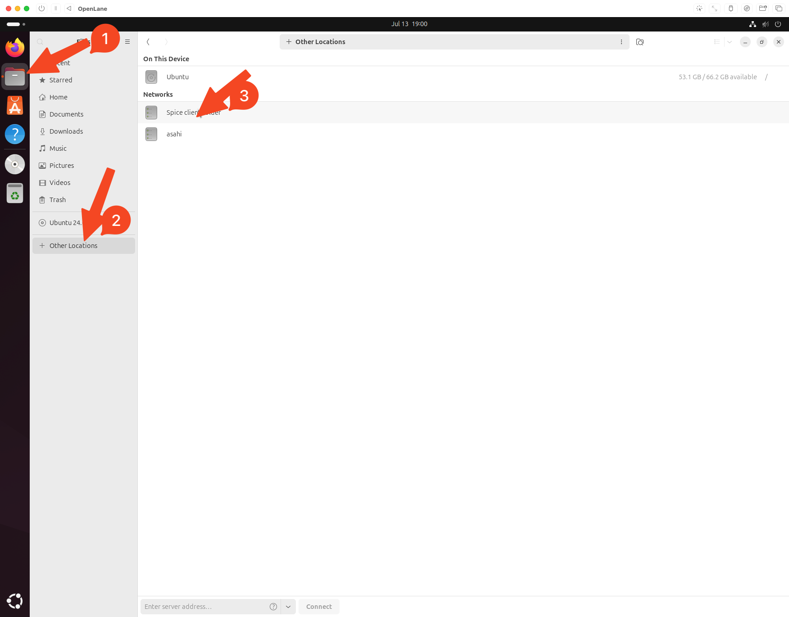

> [!NOTE]
> Note: If you get an error mounting the folder, wait a minute or two and try again.

Your folder is now mounted.
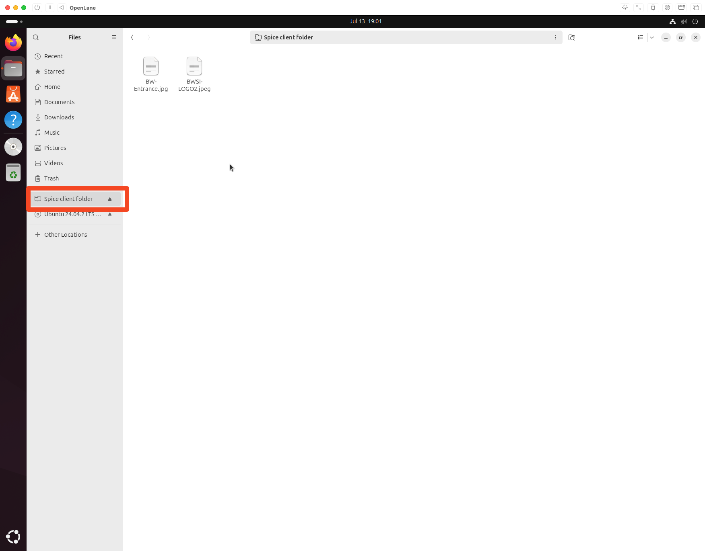

## Customization

Download the MIT BWSI wallpaper and profile picture from Releases.

Copy and paste the images from where you downloaded them to to the shared VM folder you created.


Open files, and drag and drop the pictures from the mounted folder into the pictures folder. 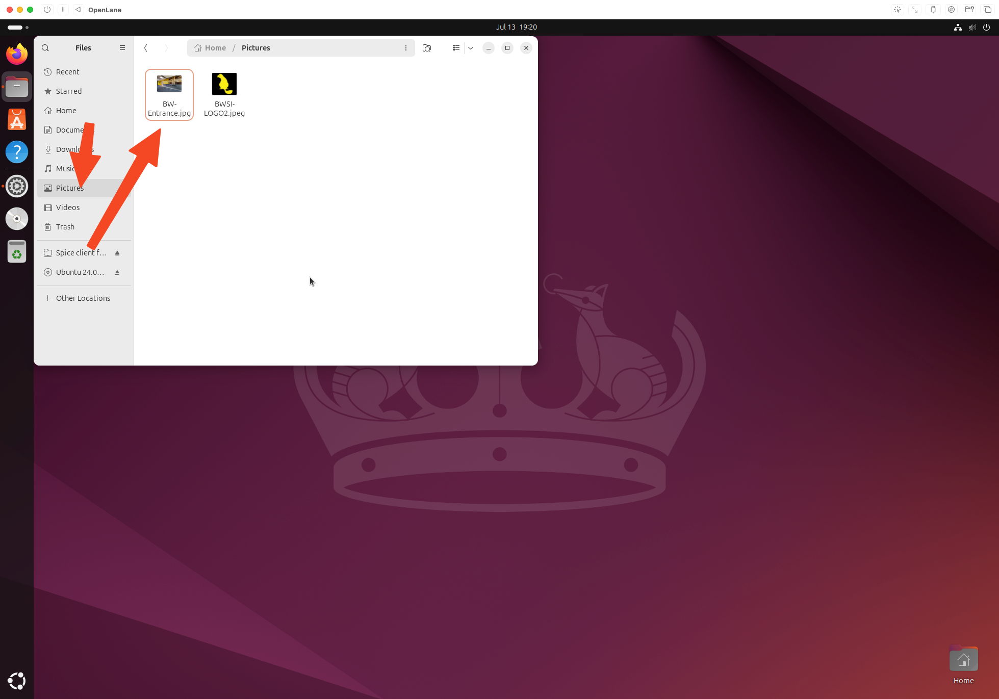

Launch the settings app in the VM by pressing ⌘, then searching `Settings`, and pressing `Enter`

Scroll down to `System`


Select `Users`
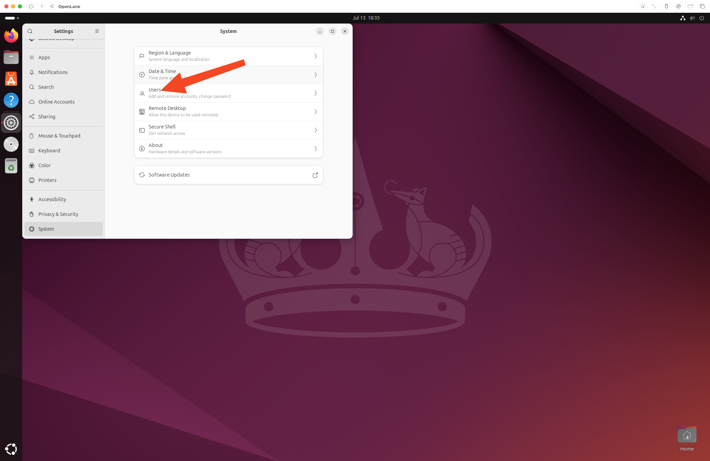

Click the Edit Button
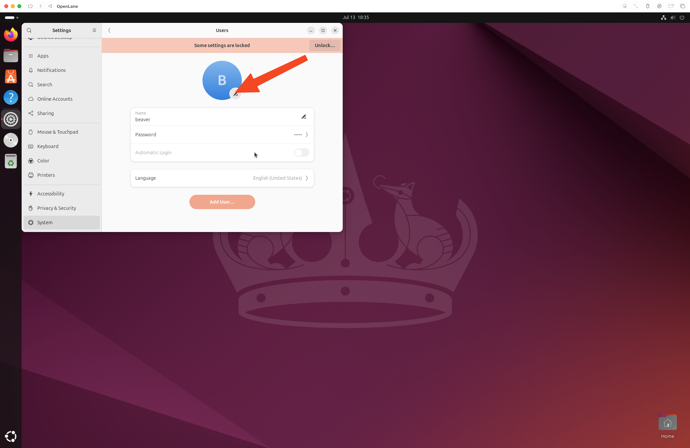

Click `Select a File...`
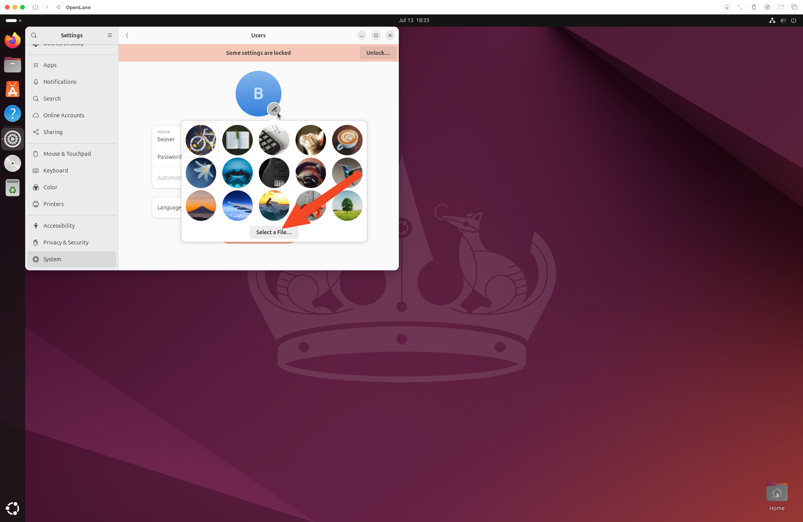

Select `BWSI-LOGO2.jpeg` in the Pictures directory, then click `Open`.
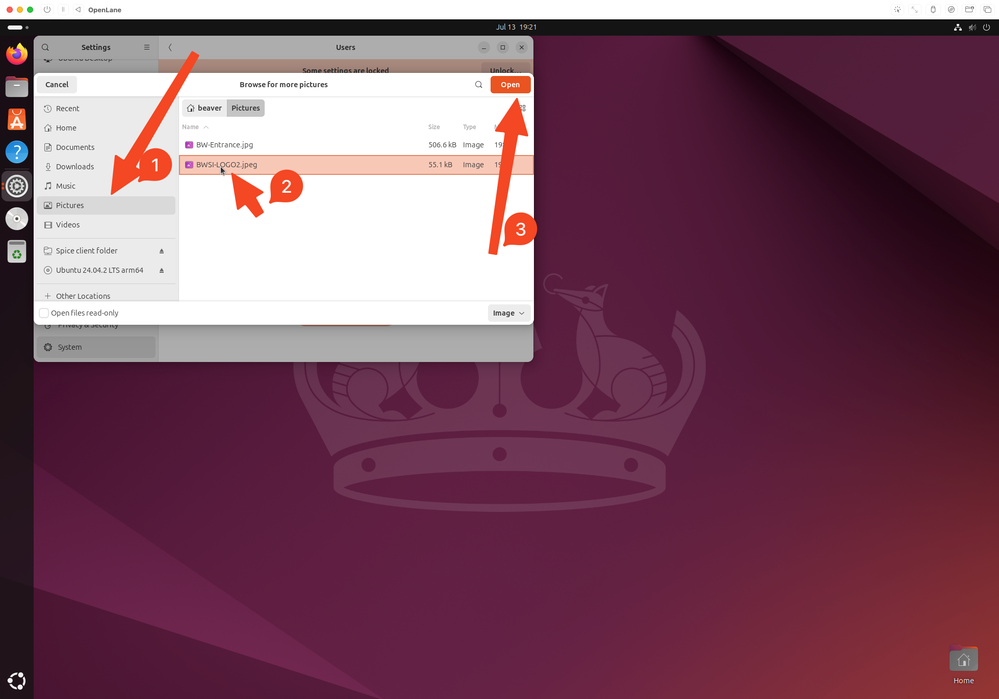

You have now changed the profile picture.


Repeat the same for the desktop wallpaper, navigating to Appearance->Background->Add Picture.
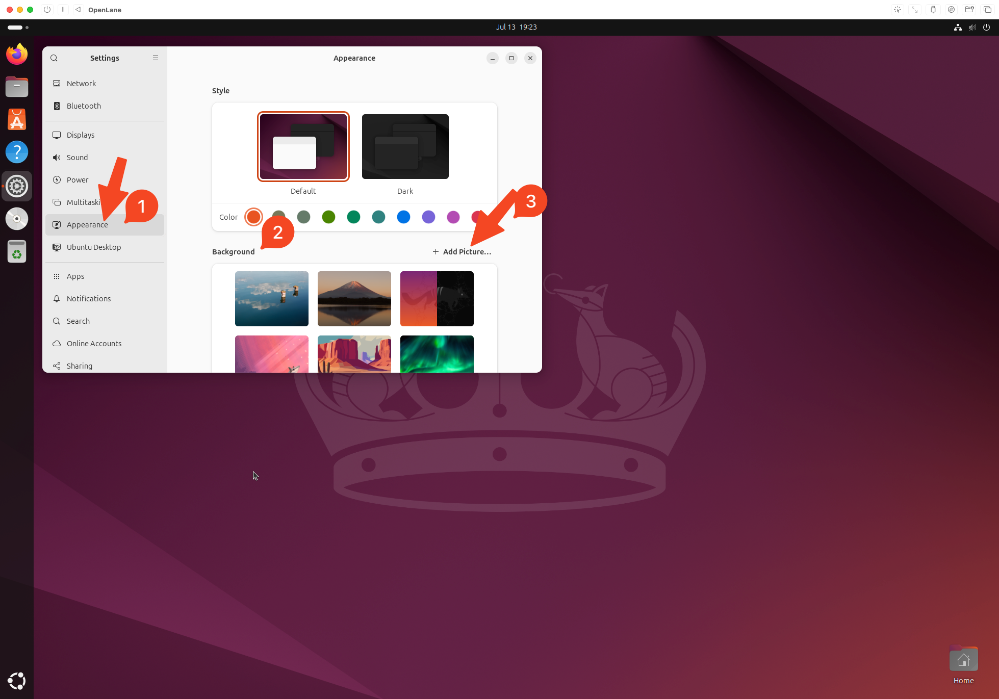

You have now customized the desktop environment.


Go to Terminal->Preferences and apply this color scheme.
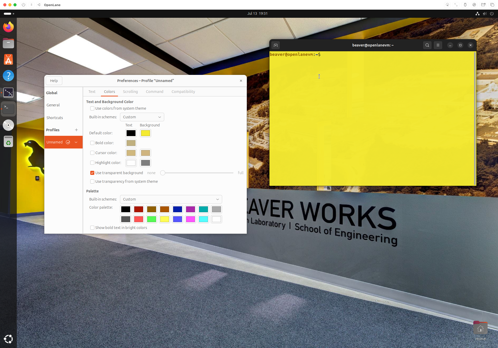
