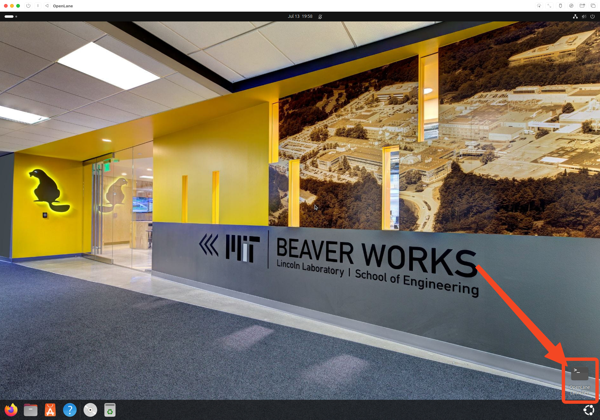

# Post Install Customization and Dev Tools

## Openlane V2

```bash
# Install Curl
sudo apt-get install -y curl
sudo apt install git

# Install Nix
curl --proto '=https' --tlsv1.2 -sSf -L https://install.determinate.systems/nix | sh -s -- install --no-confirm --extra-conf "
    extra-substituters = https://openlane.cachix.org
    extra-trusted-public-keys = openlane.cachix.org-1:qqdwh+QMNGmZAuyeQJTH9ErW57OWSvdtuwfBKdS254E=
"

# Clone the Openlane Repo
git clone https://github.com/efabless/openlane2

# Enter the cloned repo
cd openlane2

# Open the shell, this might take 2-3 minutes for the first time
nix-shell
```

Then, run

```bash
openlane --smoke-test
```

To verify your install is successful, you should see:

```bash
[19:39:08] INFO     Smoke test passed.                           __main__.py:296
```

## Add Desktop Entry for Openlane

Create the following file and contents

```bash
beaver@openlanevm:~$ cat ~/Desktop/openlane2.desktop
[Desktop Entry]
Name=OpenLane Launcher
Comment=Launch OpenLane in nix-shell
Exec=gnome-terminal -- bash -c "cd ~/openlane2 && nix-shell; exec bash"
Icon=utilities-terminal
Terminal=false
Type=Application
Categories=Development;
```

Now you can launch openlane and nix-shell with the shortcut.


## Installing GSD3D

GSD3D is used to view ICs, It doesn't come by default with openlane 2, but do feel free to read more about it [here](https://github.com/trilomix/GDS3D), below is the installation guide.

```sh
sudo apt update
sudo apt install g++ libgl1-mesa-dev libglu1-mesa-dev libx11-dev make

git clone https://github.com/trilomix/GDS3D.git
cd GDS3D

make -C linux
chmod +x linux/GDS3D
```

You now have GDS3D available in the local path, linux/GDS3D, you can add that to your PATH if you want to make it usuable anywhere :)

```sh
echo 'export PATH="'$(pwd)'/linux:$PATH"' >> ~/.bashrc && source ~/.bashrc
```
