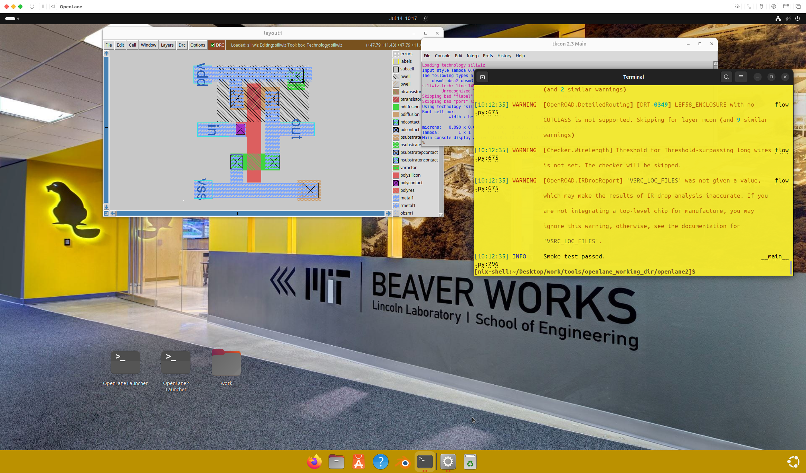
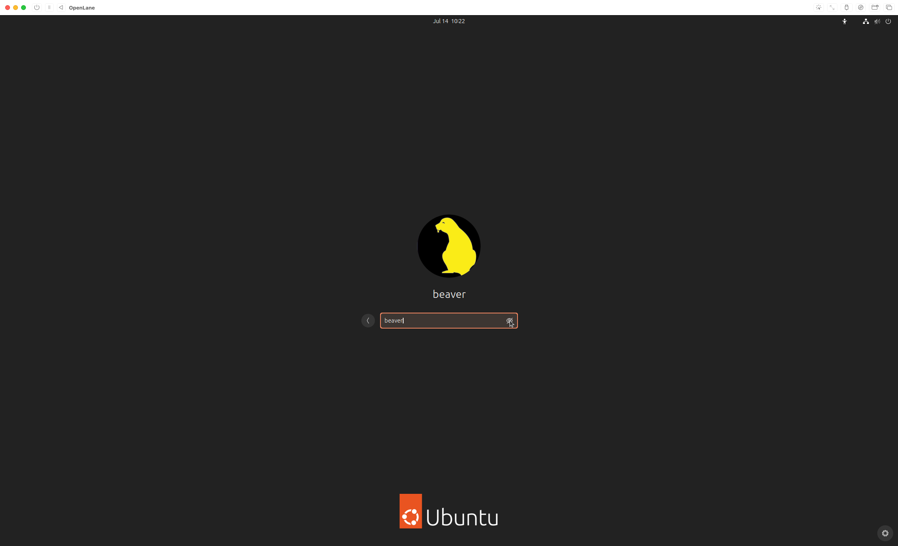

# Configuring OpenLane VM for Apple Silicon Macs

## Quick Start Options

### Prebuilt VM (If you don't know what you're doing)

Click [here](docs/prebuilt-setup/01-setup.md).

### Prebuilt VM (If you know what you are doing)

1. Download the prebuilt UTM image from [Releases](https://github.com/ZimengXiong/bASICs-openlane-apple-silicon-vm/releases).
2. Add share directory
3. Credentials: beaver:beaver@openlanevm
4. 🚀

### Manual Setup

Build your own

1. [VM Creation and Initial Setup](docs/manual-setup/01-vm-creation.md)
2. [Ubuntu Installation Process](docs/manual-setup/02-ubuntu-installation.md)
3. [Post-Installation Configuration](docs/manual-setup/03-post-installation.md)
4. [Development Tools Installation](docs/manual-setup/04-development-tools.md)
5. [System Customization](docs/manual-setup/05-system-customization.md)

## Screenshots

