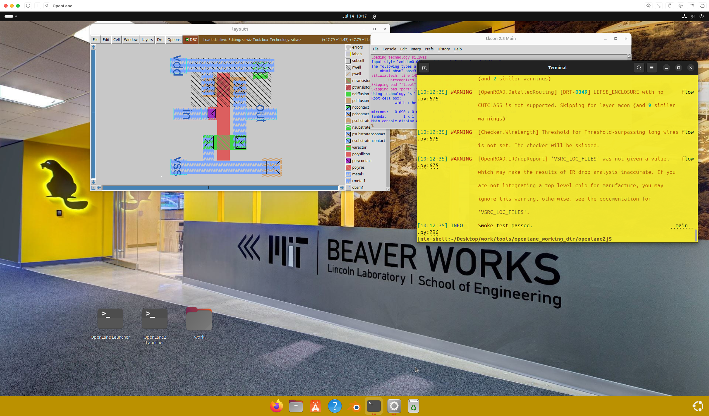
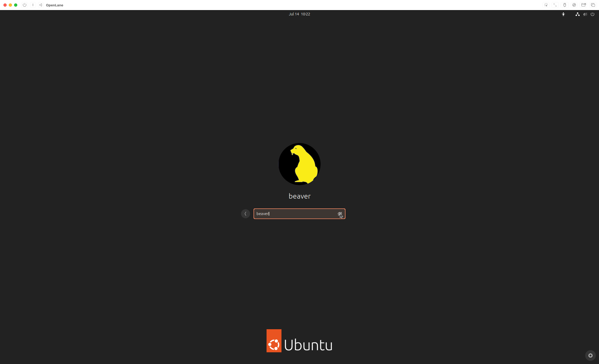

# Configuring Openlane VM for Apple Silicon Macs

## Quickstart (I don't know what I'm doing)

Click [here](Prebuilt-Apple-Silicon-UTM/Prebuilt-Apple-Silicon-UTM.md).

## Quickstart (I know what I'm doing)

1. Download the prebuilt UTM image from [Releases](https://github.com/ZimengXiong/bASICs-openlane-apple-silicon-vm/releases).
2. Add share directory
3. Credentials: beaver:beaver@openlanevm
4. 🚀

## Build your own

Build your own with the following guides.

1. [Build the VM](Manual-Apple-Silicon-UTM/Manual-Apple-Silicon-UTM.md)

2. [Configure post-install settings](Manual-Post-Ubuntu-Install-Customization-and-Basics/Manual-Post-Ubuntu-Customization-and-Basics.md)

3. [Install EDA Tools](/Users/zimengx/code/basics-openlane2-ubuntuvm/Manual-Post-Ubuntu-Install-Dev-Tools/Manual-Post-Ubuntu-Dev-Tools.md)

## Images

