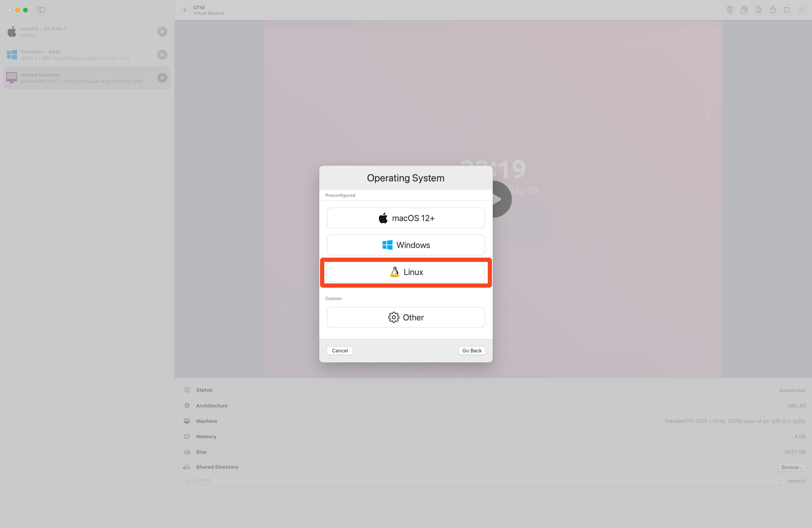
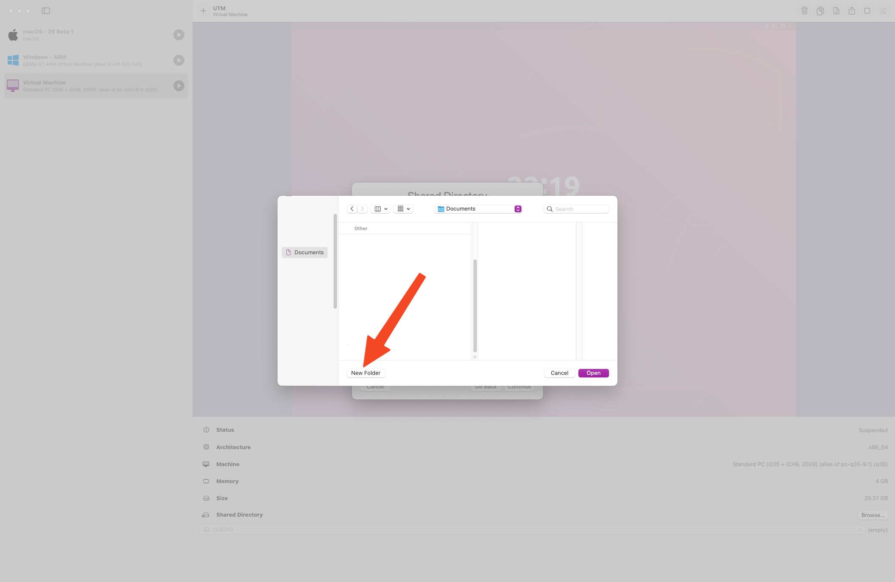

# VM Creation and Initial Setup

## Table of Contents

- [Prerequisites](#prerequisites)
- [Creating the VM](#creating-the-vm)
- [VM Configuration](#vm-configuration)

## Prerequisites

1. Download the ARM64 Ubuntu 22.04 daily build `noble-desktop-arm64.iso` from the [Releases Page](https://cdimage.ubuntu.com/noble/daily-live/current/) or this [Direct Download Link](https://cdimage.ubuntu.com/noble/daily-live/current/noble-desktop-arm64.iso)

2. Get UTM, a Virtual Machine host from [here](https://mac.getutm.app/) or with `brew install --cask utm`, using [brew](https://brew.sh/)

## Creating the VM

Open `UTM.app`, and click plus to add a new VM.

Select `Virtualize`

Select `Linux`

Click `Browse`

Select the downloaded ISO image

Leave defaults as is, click `Continue`

Depending on the size of computer disk, choose an appropriate size. This should be above 30GiB, click `Continue`

Click `Browse`

Choose a place to store the shared folder, a folder that can be accessed by both your computer and within the virtual machine. Then, click "New Folder" in this location.

Name the new folder, for example `OpenLaneVM`

Click `Open`, then `Continue`

## VM Configuration

Name the VM, e.g. `OpenLane`, then click `Save`

Click the run button next to the VM in the sidebar

Wait for the VM to boot. Do not interact with the VM. This can take 3 or more minutes.

---

**Next:** [Ubuntu Installation](02-ubuntu-installation.md)
