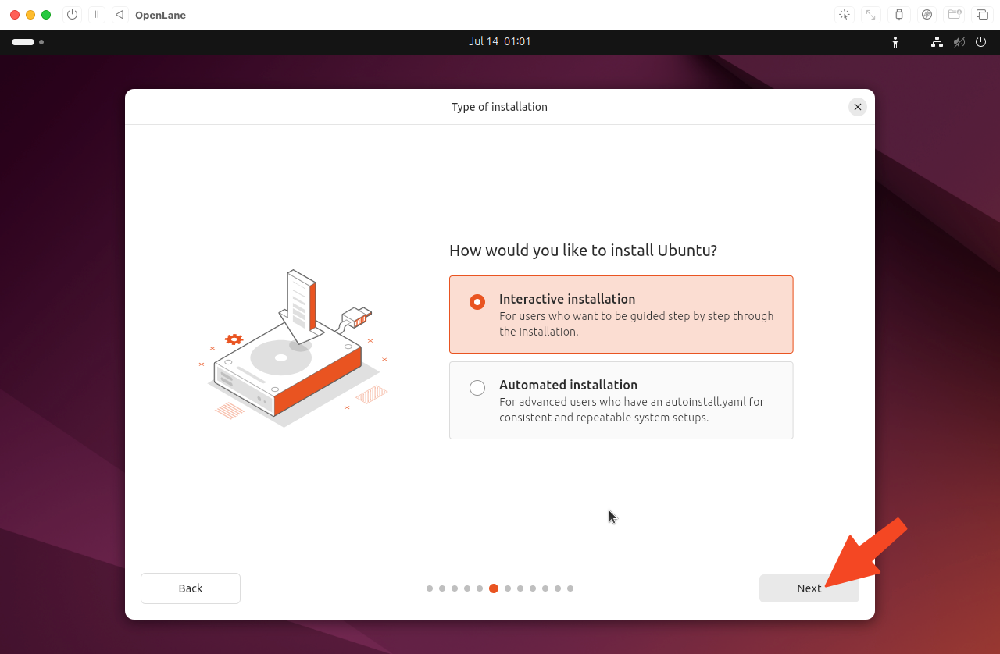
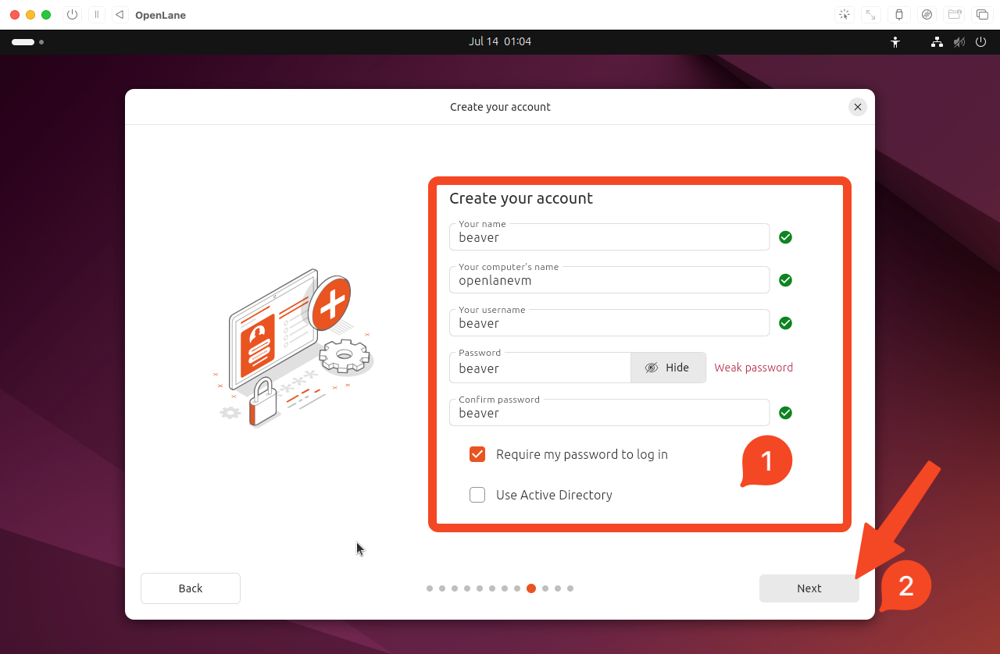

# Ubuntu Installation Process

## Table of Contents

- [Boot and Language Selection](#boot-and-language-selection)
- [Installation Steps](#installation-steps)
- [User Account Setup](#user-account-setup)
- [Completing Installation](#completing-installation)

## Boot and Language Selection

Choose `English`

## Installation Steps

Click `Next`

Click `Next`

Click `Next`

Click `Next`, leave `Install Ubuntu` selected.

Click `Next`, leave `Interactive Installation` selected.

Click `Next`, leave `Default selection` selected.

Click `Next`, leave both unchecked.

Click `Next`, leave `Erase disk and install Ubuntu` selected.

## User Account Setup

Create a name for you, your user account, and the computer. Additionally, choose a password. This password does NOT need to be secure because it is a VM and thus is protected by your computer's authentication. E.G. `beaver:beaver <beaver@openlanevm>`. Click `Next`.

Select your timezone. Click `Next`.

## Completing Installation

Click `Install`

Wait for installation to complete. This should take around 5 or more minutes.

Click `Restart Now`

---

**Previous:** [VM Creation](01-vm-creation.md) | **Next:** [Post-Installation Configuration](03-post-installation.md)
