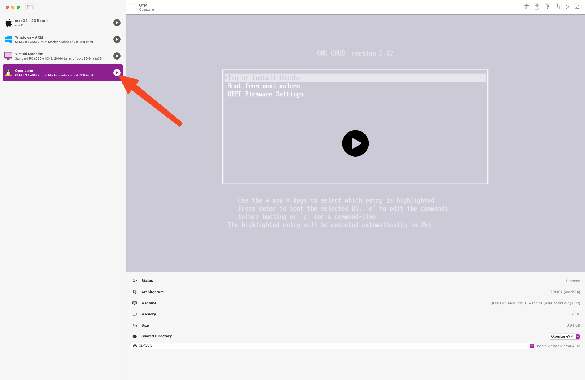
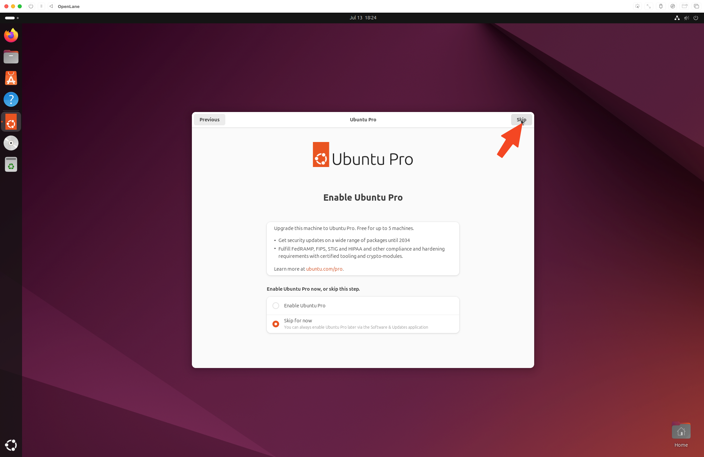

# Post-Installation Configuration

## Table of Contents

- [VM Settings Update](#vm-settings-update)
- [First Boot and Login](#first-boot-and-login)

## VM Settings Update

Once you see `Display output not Active` manually shut down the VM by right clicking the VM in UTM, and clicking `Stop`.

Right Click the VM again, and click `Edit`

Scroll down until you see `USB Drive`. Right click and click `Move Down`.

Scroll up to `Sharing`, change `Directory Share Mode` to `SPICE WebDAV`

Click `Save`

## First Boot and Login

Start the VM again by clicking the play button.

Do not interact with the VM as it is booting. It should boot in 1-2 minutes.

Click the user account or press enter.

Log in with the passcode you set.

Click `Next`

Click `Skip`

Choose your analytics preferences, and click `Next`.

Click `Finish`.

You now have Ubuntu 22.04 LTS running in a virtualized VM on your Apple Silicon Mac within UTM.

---

**Previous:** [Ubuntu Installation](02-ubuntu-installation.md) | **Next:** [Development Tools](04-development-tools.md)
