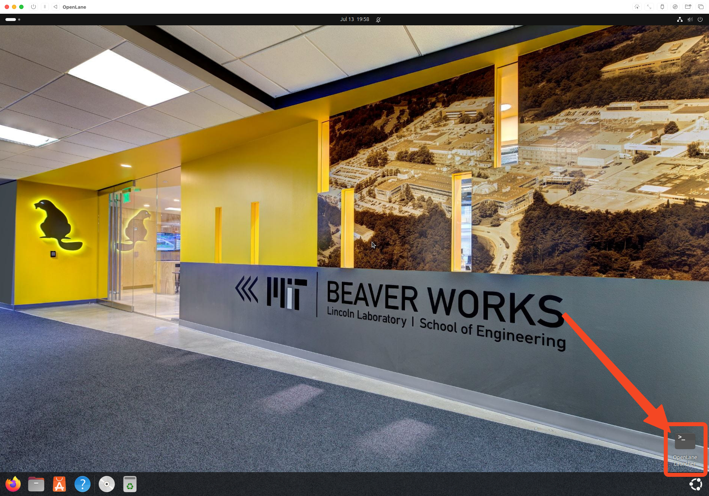

# Development Tools Installation

## Table of Contents

- [OpenLane V2 Installation](#openlane-v2-installation)
  - [Prerequisites Installation](#prerequisites-installation)
  - [Nix Installation](#nix-installation)
  - [OpenLane Setup](#openlane-setup)
  - [Verification](#verification)
- [Desktop Integration](#desktop-integration)
- [GDS3D Installation](#gds3d-installation)
  - [Dependencies](#dependencies)
  - [Build and Install](#build-and-install)
  - [Adding to PATH](#adding-to-path)

## OpenLane V2 Installation

### Prerequisites Installation

```bash
# Install Curl and Git
sudo apt-get install -y curl
sudo apt install git
```

### Nix Installation

```bash
# Install Nix
curl --proto '=https' --tlsv1.2 -sSf -L https://install.determinate.systems/nix | sh -s -- install --no-confirm --extra-conf "
    extra-substituters = https://openlane.cachix.org
    extra-trusted-public-keys = openlane.cachix.org-1:qqdwh+QMNGmZAuyeQJTH9ErW57OWSvdtuwfBKdS254E=
"
```

### OpenLane Setup

```bash
# Clone the OpenLane Repo
git clone https://github.com/efabless/openlane2

# Enter the cloned repo
cd openlane2

# Open the shell, this might take 2-3 minutes for the first time
nix-shell
```

### Verification

Then, run:

```bash
openlane --smoke-test
```

To verify your install is successful, you should see:

```bash
[19:39:08] INFO     Smoke test passed.                           __main__.py:296
```

## Desktop Integration

### Add Desktop Entry for OpenLane

Create the following file and contents:

```bash
beaver@openlanevm:~$ cat ~/Desktop/openlane2.desktop
[Desktop Entry]
Name=OpenLane Launcher
Comment=Launch OpenLane in nix-shell
Exec=gnome-terminal -- bash -c "cd ~/openlane2 && nix-shell; exec bash"
Icon=utilities-terminal
Terminal=false
Type=Application
Categories=Development;
```

Now you can launch OpenLane and nix-shell with the shortcut.


## GDS3D Installation

GDS3D is used to view ICs. It doesn't come by default with OpenLane 2, but do feel free to read more about it [here](https://github.com/trilomix/GDS3D). Below is the installation guide.

### Dependencies

```bash
sudo apt update
sudo apt install g++ libgl1-mesa-dev libglu1-mesa-dev libx11-dev make
```

### Build and Install

```bash
git clone https://github.com/trilomix/GDS3D.git
cd GDS3D

make -C linux
chmod +x linux/GDS3D
```

### Adding to PATH

You now have GDS3D available in the local path, `linux/GDS3D`. You can add that to your PATH if you want to make it usable anywhere:

```bash
echo 'export PATH="'$(pwd)'/linux:$PATH"' >> ~/.bashrc && source ~/.bashrc
```

---

**Previous:** [Post-Installation Configuration](03-post-installation.md) | **Next:** [System Customization](05-system-customization.md)
