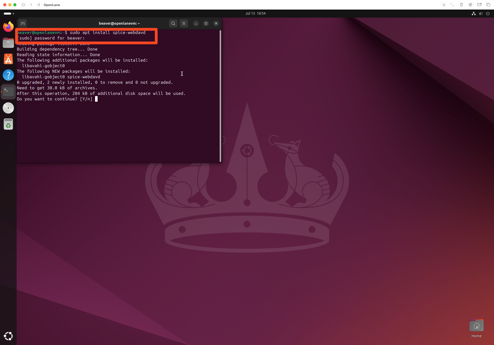
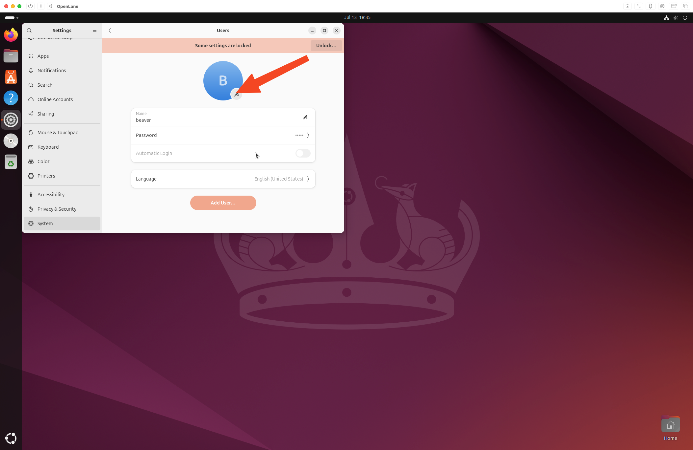

# System Customization and Basic Setup

## Table of Contents

- [Accessing the Terminal](#accessing-the-terminal)
- [Mount the Shared Drive](#mount-the-shared-drive)
- [Visual Customization](#visual-customization)
  - [Download and Transfer Images](#download-and-transfer-images)
  - [Setting Profile Picture](#setting-profile-picture)
  - [Setting Desktop Wallpaper](#setting-desktop-wallpaper)
  - [Terminal Color Scheme](#terminal-color-scheme)

## Accessing the Terminal

To use the Ubuntu Terminal, press the ⌘ key, then search for `Terminal`. Press `Enter` to launch the terminal app.


You have now launched the Ubuntu terminal.


## Mount the Shared Drive

Open the terminal, then run:

```bash
sudo apt install spice-webdavd
```

Enter your password when prompted.

Enter `Y` when prompted `Do you want to continue?`


Open files, navigate to `Other Locations`, and double click `Spice client folder`


> [!NOTE]
> If you get an error mounting the folder, wait a minute or two and try again.

Your folder is now mounted.


## Visual Customization

### Download and Transfer Images

Download the MIT BWSI wallpaper and profile picture from Releases.

Copy and paste the images from where you downloaded them to the shared VM folder you created.


Open files, and drag and drop the pictures from the mounted folder into the pictures folder.


### Setting Profile Picture

Launch the settings app in the VM by pressing ⌘, then searching `Settings`, and pressing `Enter`

Scroll down to `System`


Select `Users`


Click the Edit Button


Click `Select a File...`


Select `BWSI-LOGO2.jpeg` in the Pictures directory, then click `Open`.


You have now changed the profile picture.


### Setting Desktop Wallpaper

Repeat the same for the desktop wallpaper, navigating to Appearance->Background->Add Picture.


You have now customized the desktop environment.


### Terminal Color Scheme

Go to Terminal->Preferences and apply this color scheme.


---

**Previous:** [Development Tools](04-development-tools.md)
