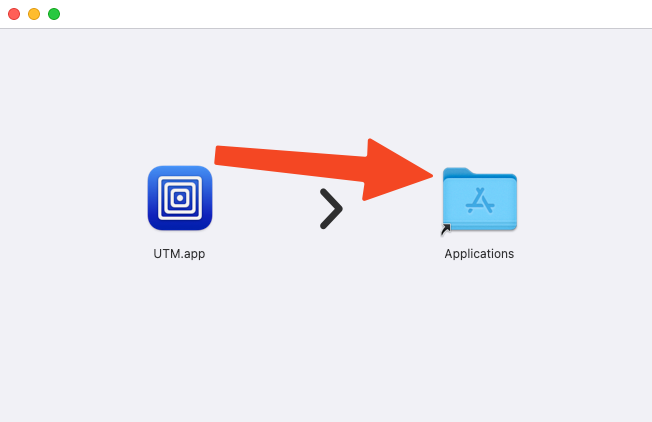

# Using Prebuilt OpenLane VM

## Table of Contents

- [Prerequisites](#prerequisites)
- [Setting Up UTM](#setting-up-utm)
- [Opening the VM Image](#opening-the-vm-image)
- [First Boot and Configuration](#first-boot-and-configuration)
- [File Sharing Setup](#file-sharing-setup)

## Prerequisites

1. Download the prebuilt UTM image from the Google Drive link in [releases](https://github.com/ZimengXiong/basics-openlane2-ubuntuvm/releases)

2. Get UTM, a Virtual Machine host from [here](https://github.com/utmapp/UTM/releases/latest/download/UTM.dmg) or with `brew install --cask utm`, using [brew](https://brew.sh/)

## Setting Up UTM

After downloading UTM, double click the downloaded file.

Drag and drop the UTM app to the `/Applications` folder.

You can close all opened windows now.

Press ⌘+Space, and type in `UTM` then press enter to launch the app.

## Opening the VM Image

Move the downloaded image to a persistent location, for example `~/Documents`

Create a new folder on your host machine in `~/Documents` called `OpenLaneVMShared`

In UTM, click "Create a new Virtual Machine"

Click `Existing->Open...`

Load in the image you downloaded and placed in a persistent location.

Click `Shared Directory->Browse`

Navigate to and select the directory you created in `~/Documents/OpenLaneVMShared`

---

**Next:** [First Boot and Login](02-first-boot.md)
