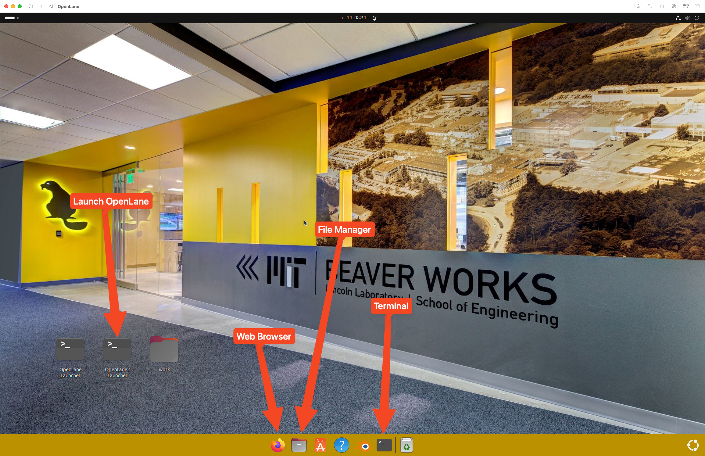

# First Boot and Login

## Table of Contents

- [Starting the VM](#starting-the-vm)
- [Login Process](#login-process)
- [File Sharing Setup](#file-sharing-setup)

## Starting the VM

Click the run button to launch the VM.

Wait for it to boot up, do not interact with the VM as it is booting. This can take 2-5 minutes, depending on your computer.

## Login Process

Press enter to login to the selected account.

Type in the password: `beaver` for the user account `beaver`

The display output may turn off during this process, give it 2-5 minutes for first startup.

You have now successfully launched the VM.

## File Sharing Setup

To share files between the host and the VM, navigate to the file manager, then scroll down to "Other Locations," then double click on "Spice client folder"

A new folder should appear, you may click it to enter the folder.

Files that you move to `~/Documents/OpenLaneVMShared` will now appear in this folder.

> [!NOTE]
> To open the files in the VM, you may need to copy the files from the shared folder into a local directory in the VM, like `/home/downloads`.

---

**Previous:** [Setup](01-setup.md) | **Next:** [Installation Verification](03-verification.md)
