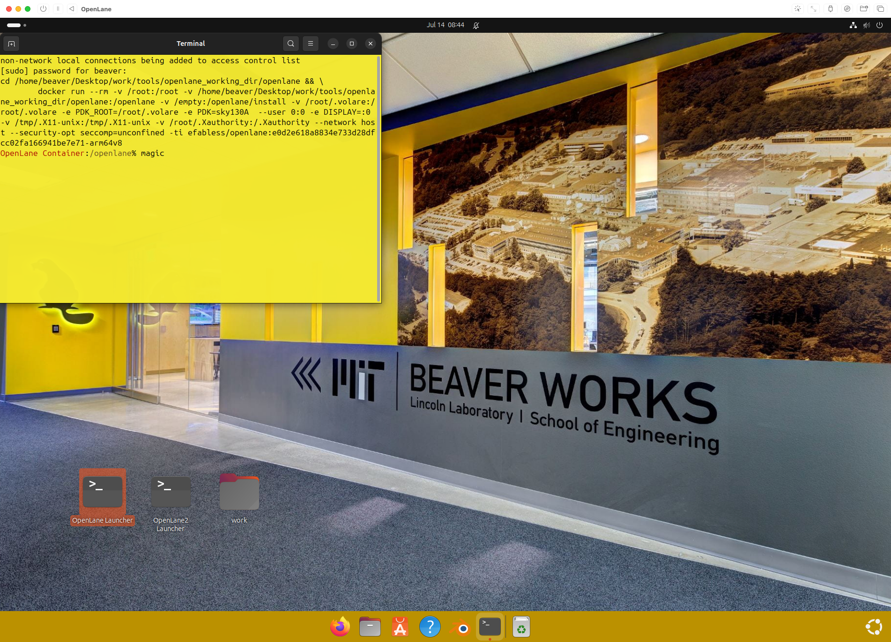
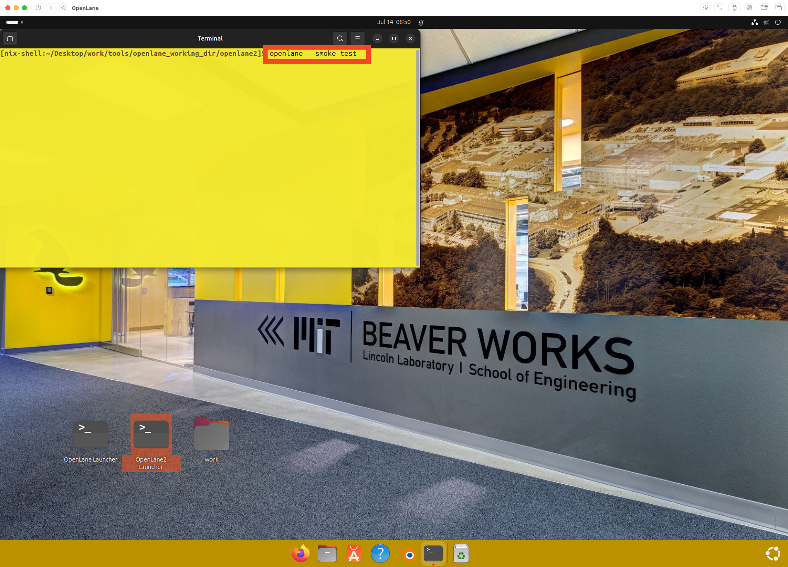

# Installation Verification

## Table of Contents

- [OpenLane Classic Verification](#openlane-classic-verification)
- [OpenLane V2 Verification](#openlane-v2-verification)

## OpenLane Classic Verification

Double click "OpenLane Launcher". It will prompt for a password, enter `beaver` then press enter. You will not see the password as you type.

Type in `magic` and press enter.

Confirm the window server is working—you should see two windows appear.

Close the windows that opened.

Type `exit` in the terminal.

Type `sudo make test` in the terminal, press enter. If you are asked for a password, type in `beaver`.

Wait for the commands to run. You should see `Basic Test Passed` after the test has concluded.

Your OpenLane install is correctly configured.

## OpenLane V2 Verification

Close all windows from the previous step.

Double click `OpenLane2 Launcher`

You should see a terminal appear, type in `openlane --smoke-test`

Wait for the test to run. You should see `Smoke Test Passed` as the last line of output.

Your OpenLane V2 install is correctly configured.

---

**Previous:** [First Boot and Login](02-first-boot.md)
